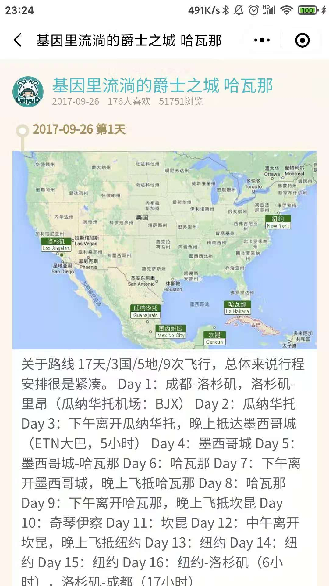
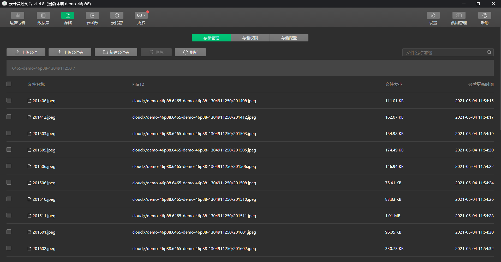

# “远诗” 微信小程序

一款主要介绍诗词和旅记的小程序。

后台资源放在微信小程序的云存储上。

## 体验二维码

## 小程序截图

## 安装教程

### 1、导入代码

直接将`poem`文件夹导入到微信小程序的开发工具上

## 2、导入数据

将`data`文件夹下的所有`json`文件，都导入微信小程序的云数据库上

### 3、导入图片

自己找图片导入到微信小程序的云存储上，像这样：

## 参考项目

[breadtrip](https://github.com/romoo/weapp-demo-breadtrip)

